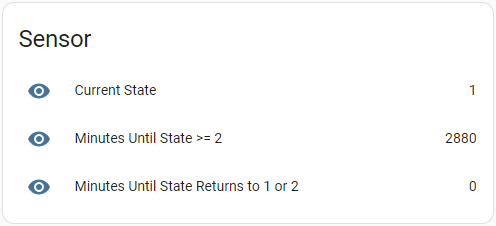

# StromGedacht Sensor for Home Assistant

> ⚠️ **IN DEVELOPMENT AND BARELY TESTED**

The Stromgedacht Sensor is a custom component for Home Assistant that integrates data from the Stromgedacht API (https://api.stromgedacht.de/v1/states). It provides three sensors:

1. Current state of the power grid.
2. The number of minutes until the state is greater than or equal to 2 (Orange). If the state remains green or yellow within the queried interval, the total minutes of the entire interval are returned. If the current state is orange or red, 0 is returned.
3. The number of minutes until the state changes from red or orange back to green or yellow. If this does not happen within the known interval, the entire known interval is returned. If the current state is green or yellow, 0 is returned.

The API is queried cyclically every 10 minutes for the next 48 hours.

## States

The Stromgedacht Sensor returns the power grid's current state, which can be one of the following four states:

1. **Green State (1)**: Normal operation - No action is required. The power grid is functioning without any issues, and there is no need for you to adjust your energy consumption.
2. **Yellow State (2)**: Reschedule consumption - It is recommended to use electricity now, as the power grid is experiencing a moderate load. By using electricity during this period, you can help alleviate the stress on the grid.
3. **Orange State (3)**: Reduce consumption - To save costs and reduce CO2 emissions, it is advised to minimize your energy usage during this period. The power grid is experiencing a higher load, and cutting down on consumption can help maintain stability.
4. **Red State (4)**: Reduce consumption urgently - The power grid is under significant stress, and it is crucial to decrease your electricity usage to prevent potential power shortages. This state indicates an emergency situation, where immediate action is necessary to maintain the stability of the grid.

## Installation

1. Create a folder named `custom_components` in your Home Assistant config directory, if it does not already exist.
2. Create a folder named "stromgedacht" in this `custom_components` folder.
2. Copy the files `__init__.py`, `manifest.json` and `sensor.py` files from this repository into the `custom_components` folder:
    ```
    .config/
    └── custom_components/
        └── stromgedacht/
            ├── __init__.py
            └── manifest.json
            └── sensor.py
    ```
3. Add the following to your configuration.yaml file:
    ```yaml
    sensor:
    - platform: stromgedacht
        zip: YOUR_ZIP_CODE
    ```
    Replace YOUR_ZIP_CODE with your actual zip code.
4. Restart Home Assistant.

## Usage

After installation, you will see three new sensors in Home Assistant:

1. Current State
2. Minutes Until State >= 2
3. Minutes Until State Returnns to 1 or 2



These sensors can be used in automations, scripts, or displayed on the Home Assistant dashboard.